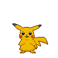

<h2 align="center">Hello world 👋, Welcome to my profile</h2>

<!-- 
<em>Associate Technical Lead at <a href="https://www.oneorigin.us/">OneOrigin
</a>
</em>
 -->

<!-- 
<i>I'm a Front-End developer</i>
 -->

<!--  -->

<!-- 
Technology:
 -->
<!--  -->

<h4>About me:</h4>

<ul type="disc">
<li>
 <b>Name:</b> Vyacheslav</li>
<li>
 <b>Development:</b> Front-End</li>
<li>
<b>Loves:</b> coding, games, anime
</li>
<li>
<b>Gender:</b> He/Him
</li>
<!-- <li>
<b>LastMucic:</b> https://scrobble.egirl.ing
</li> -->
<li>
<b>Hobbys:</b> Web site coding, skiing, gymnasium 
</li>
<li>
<b>years old:</b> 19
</li>
</ul>

<!--  -->

<!--  -->
<!--  -->
<!--  -->
<!--  -->
<!--  -->

<h4>My technologies:</h4>

                        

<h4>Plugins for code:</h4>

    

<h4>UI libraries:</h4>

  

<h4>Tools:</h4>

  

<h4>IDE, which I use:</h4>

 

<h2>My Projects:</h2>

<table width="960px">
<tr>
<td valign="top" width="33%">
<strong>
<a href="https://meow-double.github.io/crypto-app/">crypto-app
</a></strong>
</td>
<td valign="top" width="66%">

        

</td>
</tr>
<tr>
<td valign="top" width="33%">
<strong>
<a href="https://meow-double.github.io/MidasMarket/">MidasMarket</a></strong>
</td>
<td valign="top" width="33%">

      

</td>
</tr>
<tr>
<td valign="top" width="33%">
<strong><a href="#!">LeanGroup</a></strong>
</td>
<td valign="top" width="33%">

    

</td>
</tr>
<tr>
<td valign="top" width="33%">
<strong><a href="https://meow-double.github.io/QSolutions/">QSolutions</a></strong>
</td>
<td valign="top" width="33%">

   

</td>
</tr>
<tr>
<td valign="top" width="33%">
<strong><a href="https://meow-double.github.io/PascalVent/">PascalVent</a></strong>
</td>
<td valign="top" width="33%">

   

</td>
</tr>
</table>

 

#### My social links:

<!--  -->

  
<!--  -->
<!--  -->
<!--  -->

